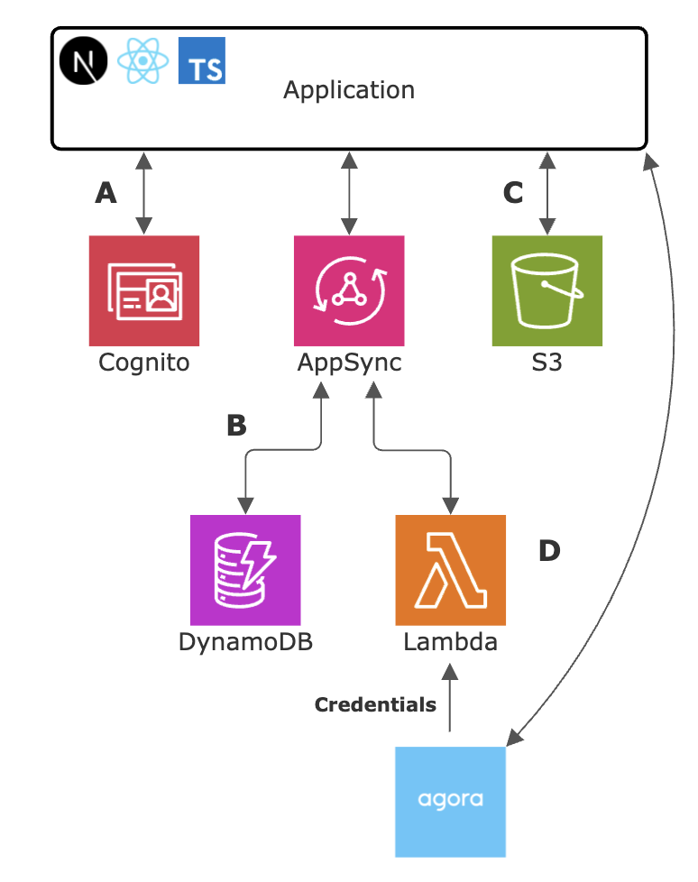

# Cosmos

🚧 **Under Construction!** 🚧

Cosmos is a **server-based** application built with **Next.js** and **AWS Amplify**. It aims to replicate the core features of Discord, including user authentication, real-time messaging, live video conferencing, file uploads, and multi-channel support. Users can create and join **servers**, where they can communicate within specific channels.

This project is my attempt at exploring serverless architecture and modern full-stack development with AWS.

## Features

- **User Authentication**: Secure authentication powered by AWS Cognito.
- **Real-time Messaging**: Instant communication using AWS AppSync subscriptions.
- **Server Channels**: Create and manage servers with dedicated channels for different topics and conversations.
- **User Profiles**: Customize user profiles with avatars.
- **Media Uploads**: Upload and retrieve media assets like images and videos.
- **Real-time Video Communication**: Join video channels for seamless voice and video streaming, implemented using the Agora SDK.
- **Serverless Backend**: Backend services powered by AWS, including authentication, data management, and real-time communication. See the [Application Architecture](#application-architecture) section for details.

## Technologies Used

- **[Next.js](https://nextjs.org/)**: A React framework for building the frontend.
- **[AWS Amplify](https://aws.amazon.com/amplify/)**: A comprehensive library for building web applications.
- **[AWS Cognito](https://aws.amazon.com/cognito/)**: User authentication and authorization.
- **[AWS AppSync](https://aws.amazon.com/appsync/)**: Real-time messaging and data synchronization.
- **[AWS Lambda](https://aws.amazon.com/lambda/)**: Serverless functions for unique token generation used for secure video chatting.
- **[Amazon S3](https://aws.amazon.com/s3/)**: Scalable storage for media assets.
- **[Amazon DynamoDB](https://aws.amazon.com/dynamodb/)**: NoSQL database for application data.
- **[Agora](https://www.agora.io/)**: Real-time video and voice communication.
- **[GraphQL](https://graphql.org/)**: Query language for data interaction.
- **[Tailwind CSS](https://tailwindcss.com/)**: CSS framework for easy styling.
- **[Daisy UI](https://daisyui.com/)**: Tailwind-based Component Library for modern design and flow.

## Application Architecture

Cosmos leverages multiple AWS services and third-party integrations to deliver a secure, scalable, and real-time communication platform. The diagram below illustrates how these services interact with the client application.

### A. Secure User Authentication with Amazon Cognito

The application utilizes Amazon Cognito User Pools for robust user authentication. The `/onboard` page integrates the AWS Amplify Authenticator component to facilitate seamless account creation and login. Upon successful authentication, Cognito issues JSON Web Tokens (JWTs), which are used to authorize requests to protected backend resources, ensuring secure access to the application’s functionality.

### B. GraphQL API and NoSQL Database with AppSync and DynamoDB

The application communicates with an AWS AppSync GraphQL API endpoint to manage data operations. GraphQL queries and mutations are processed by AppSync resolvers, defined in TypeScript files within the `/amplify` directory. These resolvers interact with custom Amazon DynamoDB tables to perform CRUD operations. DynamoDB stores essential application data, including expanded user profiles, server and channel metadata, messages, and more, ensuring efficient and scalable data management.

### C. Media Storage with Amazon S3

The application handles media assets by directly uploading and downloading files to and from designated Amazon S3 buckets, based on the content type and authenticated user. Media objects are organized using key prefixes ( ex. `media/{entity_id}/*` ) for logical grouping, enabling efficient storage and retrieval of user-uploaded content such as images and videos.

### D. Real-Time Video Communication with AWS Lambda and Agora

The application implements real-time video communication through a custom AWS Lambda function that uses the Agora Access Token library. The Lambda function takes a dynamic channel name provided by the client, the authenticated user’s ID (from Amazon Cognito), and secure Agora credentials (stored as secrets) to generate a short-lived, user-specific Real-Time Communication (RTC) token. This token, along with the Agora App ID, is returned to the client via an AppSync query. The client application then uses the Agora RTC SDK to establish a direct connection to the Agora Real-Time Communication Network, joining the specified video channel and enabling a secure, seamless connection with other participants in real-time.
